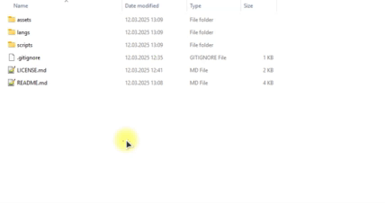

# Скрипты для удаления префиксов из названий файлов и папок

[](LICENSE)

## Выберите язык:

| Русский    | English                              | Español                              | 中文                              | Français                              | Deutsch                              |
|------------|--------------------------------------|--------------------------------------|---------------------------------|---------------------------------------|--------------------------------------|
| **Выбран** | [English](./langs/README_en.md) | [Español](./langs/README_es.md) | [中文](./langs/README_zh.md) | [Français](./langs/README_fr.md) | [Deutsch](./langs/README_de.md) |

## Описание

Эти скрипты позволяют массово удалять указанные префиксы из названий файлов и папок. Они рекурсивно обрабатывают все элементы в выбранной директории, включая вложенные подпапки. Поддерживаются:
- Удаление нескольких префиксов за один запуск.
- Работа в `Linux/macOS` (через `Bash`) и `Windows` (через `PowerShell`).
- Генерация отчёта с временем выполнения, использованием памяти и статистикой.

## Цели и назначение

Скрипты предназначены для:

- Очистка названий файлов после скачивания (например, удаление рекламных тегов).
- Упрощение структуры проектов.
- Автоматизация рутинных задач.

## Структура проекта

```text
.
├── assets/                 # Примеры использования и результаты работы скриптов
├── langs/                  # Локализация README.md на другие языки
├── scripts/
│   ├── remove_prefix.sh    # Скрипт для Linux/macOS
│   └── remove_prefix.ps1   # Скрипт для Windows
├── LICENSE.md
└── README.md
```
## Как использовать

### Windows (PowerShell)

- Клонировать репозиторий: `git clone git@github.com:yaleksandr89/remove-prefix.git`.
- Откройте терминал и перейдите в папке `scripts/`



- Разрешите выполнение скриптов. Необязательно, только если при попытке выполнить скрипт будет появляться ошибка. Терминал потребуется предварительно запустить от имени администратора (затем политику безопасности можно вернуть назад: `Set-ExecutionPolicy RemoteSigned -Scope CurrentUser`):
```shell
Set-ExecutionPolicy Unrestricted -Scope CurrentUser
```
- Запустите скрипт:
```shell
.\remove_prefix.ps1
```
- Следуйте инструкциям на экране:
  - Введите список префиксов через запятую.
  - Укажите путь к папке.
- Дождитесь завершения работы скрипта.


### Linux/macOS (Bash)

- Клонировать репозиторий: `git clone git@github.com:yaleksandr89/remove-prefix.git`.
- Откройте терминал и перейдите в папку со скриптом:

- Дайте скрипту права на выполнение:
```bash
chmod +x remove_prefix.sh
```
- Запустите скрипт:
```bash
./remove_prefix.sh
```
- Следуйте инструкциям на экране:
    - Введите список префиксов через запятую.
    - Укажите путь к папке.
- Дождитесь завершения работы скрипта.


## Отчёт

После выполнения скрипт покажет:

- Время выполнения.
- Использованную память.
- Количество обработанных файлов и папок.

Для windows:


Для Linux:


## Совместимость

- Windows 10/11 (PowerShell 5.1 или выше)
- Linux (bash 4.0+)
- macOS (bash 4.0+)
