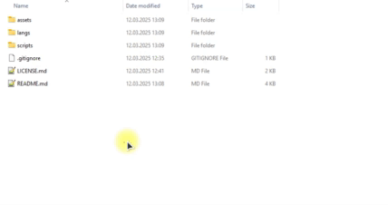
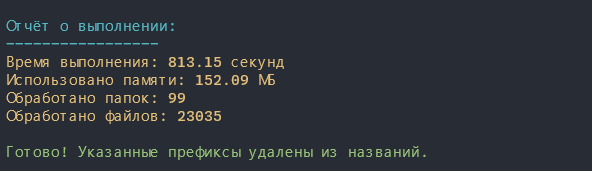
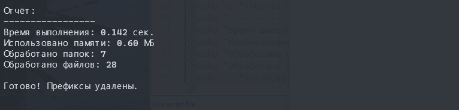

# Scripts for Removing Prefixes from File and Folder Names

[](LICENSE)

## Select Language:

| Русский | **English** | Español | 中文 | Français | Deutsch |
|---------|------------|---------|---------|----------|---------|
| [Русский](../README.md) | **Selected** | [Español](./README_es.md) | [中文](./README_zh.md) | [Français](./README_fr.md) | [Deutsch](./README_de.md) |

## Description

These scripts allow you to batch remove specified prefixes from file and folder names. They recursively process all items in the selected directory, including nested subfolders. Features:
- Removal of multiple prefixes in a single run.
- Works on `Linux/macOS` (via `Bash`) and `Windows` (via `PowerShell`).
- Generates a report with execution time, memory usage, and statistics.

## Purpose and Use Cases

These scripts are designed for:
- Cleaning filenames after downloading (e.g., removing advertising tags).
- Simplifying project structures.
- Automating routine tasks.

## Project Structure

```text
.
├── assets/                 # Usage examples and script results
├── langs/                  # README.md translations
├── scripts/
│   ├── remove_prefix.sh    # Script for Linux/macOS
│   └── remove_prefix.ps1   # Script for Windows
├── LICENSE.md
└── README.md
```

## How to Use

### Windows (PowerShell)

- Clone the repository: `git clone git@github.com:yaleksandr89/remove-prefix.git`
- Open the terminal and navigate to the `scripts/` folder



- Allow script execution if necessary. Only required if you receive an execution policy error (the terminal must be opened as an administrator). You can later reset the security policy with `Set-ExecutionPolicy RemoteSigned -Scope CurrentUser`:
  ```shell
  Set-ExecutionPolicy Unrestricted -Scope CurrentUser
  ```
- Run the script:
  ```shell
  .\remove_prefix.ps1
  ```
- Follow the on-screen instructions:
    - Enter a list of prefixes separated by commas.
    - Specify the folder path.
- Wait for the script to complete.


### Linux/macOS (Bash)

- Clone the repository: `git clone git@github.com:yaleksandr89/remove-prefix.git`
- Open the terminal and navigate to the script folder:
- Grant execution permissions to the script:
  ```bash
  chmod +x remove_prefix.sh
  ```
- Run the script:
  ```bash
  ./remove_prefix.sh
  ```
- Follow the on-screen instructions:
    - Enter a list of prefixes separated by commas.
    - Specify the folder path.
- Wait for the script to complete.


## Report

After execution, the script displays:

- Execution time.
- Memory usage.
- Number of processed files and folders.

For Windows:



For Linux:



## Compatibility

- Windows 10/11 (PowerShell 5.1 or higher)
- Linux (bash 4.0+)
- macOS (bash 4.0+)