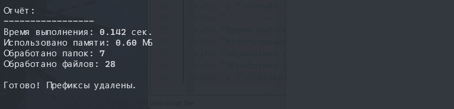

# Scripts para eliminar prefijos de nombres de archivos y carpetas

[](LICENSE)

## Elija Idioma:

| Русский                                                     | English                   | Español                              | 中文                              | Français                              | Deutsch                              |
|-------------------------------------------------------------|---------------------------|--------------------------------------|---------------------------------|---------------------------------------|--------------------------------------|
| [Русский](../README.md) | [English](./README_en.md) | **Seleccionado** | [中文](./README_zh.md) | [Français](./README_fr.md) | [Deutsch](./README_de.md) |

## Descripción

Estos scripts permiten eliminar en masa los prefijos especificados de los nombres de archivos y carpetas. Procesan recursivamente todos los elementos en el directorio seleccionado, incluidas las subcarpetas anidadas. Soporta:
- Eliminación de múltiples prefijos en una sola ejecución.
- Compatible con `Linux/macOS` (a través de `Bash`) y `Windows` (a través de `PowerShell`).
- Generación de un informe con el tiempo de ejecución, uso de memoria y estadísticas.

## Objetivos y Propósito

Estos scripts están diseñados para:

- Limpiar nombres de archivos después de la descarga (por ejemplo, eliminar etiquetas publicitarias).
- Simplificar la estructura de los proyectos.
- Automatizar tareas repetitivas.

## Estructura del Proyecto

```text
.
├── assets/                 # Ejemplos de uso y resultados de los scripts
├── langs/                  # Localización de README.md a otros idiomas
├── scripts/
│   ├── remove_prefix.sh    # Script para Linux/macOS
│   └── remove_prefix.ps1   # Script para Windows
├── LICENSE.md
└── README.md
```
## Cómo usarlo

### Windows (PowerShell)

- Clonar el repositorio: `git clone git@github.com:yaleksandr89/remove-prefix.git`.
- Abrir la terminal y navegar a la carpeta `scripts/`.


- Permitir la ejecución de scripts si aparece un error al intentar ejecutar el script. Para ello, es necesario abrir el terminal como administrador (posteriormente, se puede restaurar la configuración de seguridad con: `Set-ExecutionPolicy RemoteSigned -Scope CurrentUser`):
```shell
Set-ExecutionPolicy Unrestricted -Scope CurrentUser
```
- Ejecutar el script:
```shell
.\remove_prefix.ps1
```
- Seguir las instrucciones en pantalla:
    - Introducir los prefijos separados por comas.
    - Especificar la ruta de la carpeta.
- Esperar a que finalice la ejecución.


### Linux/macOS (Bash)

- Clonar el repositorio: `git clone git@github.com:yaleksandr89/remove-prefix.git`.
- Abrir la terminal y navegar a la carpeta del script.

- Conceder permisos de ejecución al script:
```bash
chmod +x remove_prefix.sh
```
- Ejecutar el script:
```bash
./remove_prefix.sh
```
- Seguir las instrucciones en pantalla:
    - Introducir los prefijos separados por comas.
    - Especificar la ruta de la carpeta.
- Esperar a que finalice la ejecución.


## Informe

Después de la ejecución, el script mostrará:

- Tiempo de ejecución.
- Memoria utilizada.
- Número de archivos y carpetas procesados.

Para Windows:


Para Linux:



## Compatibilidad

- Windows 10/11 (PowerShell 5.1 o superior)
- Linux (bash 4.0+)
- macOS (bash 4.0+)

