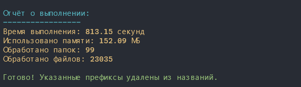

# 删除文件和文件夹前缀的脚本

## 选择语言:

| Русский  | English                              | Español                              | 中文                              | Français                              | Deutsch                              |
|----------|--------------------------------------|--------------------------------------|---------------------------------|---------------------------------------|--------------------------------------|
| [Русский](../README.md) | [English](./README_en.md) | [Español](./README_es.md) | **已选** | [Français](./README_fr.md) | [Deutsch](./README_de.md) |

## 描述

这些脚本允许批量删除文件和文件夹名称中的指定前缀。它们递归地处理选定目录中的所有元素，包括嵌套的子文件夹。支持以下功能：
- 一次删除多个前缀。
- 支持 `Linux/macOS`（通过 `Bash`）和 `Windows`（通过 `PowerShell`）。
- 生成报告，包含执行时间、内存使用情况和统计信息。

## 目标和用途

这些脚本的目的是：

- 清理下载文件的名称（例如，删除广告标签）。
- 简化项目结构。
- 自动化日常任务。

## 项目结构

```text
.
├── assets/                 # 脚本使用示例和结果
├── langs/                  # README.md 文件的其他语言本地化
├── scripts/
│   ├── remove_prefix.sh    # 适用于 Linux/macOS 的脚本
│   └── remove_prefix.ps1   # 适用于 Windows 的脚本
├── LICENSE.md
└── README.md
```

## 如何使用

### Windows (PowerShell)

- 克隆仓库：`git clone git@github.com:yaleksandr89/remove-prefix.git`。
- 打开终端并进入 `scripts/` 文件夹。


- 允许执行脚本。如果在尝试运行脚本时遇到错误，这一步是必需的。需要以管理员身份运行终端（之后可以恢复安全策略：`Set-ExecutionPolicy RemoteSigned -Scope CurrentUser`）：
```shell
Set-ExecutionPolicy Unrestricted -Scope CurrentUser
```

- 运行脚本：
```shell
.\remove_prefix.ps1
```

- 按照屏幕上的指示操作：
    - 输入前缀列表（用逗号分隔）。
    - 指定文件夹路径。
- 等待脚本完成。


### Linux/macOS (Bash)

- 克隆仓库：`git clone git@github.com:yaleksandr89/remove-prefix.git`。
- 打开终端并进入脚本所在文件夹。
- 授予脚本执行权限：
```bash
- chmod +x remove_prefix.sh
```

- 运行脚本：
```bash
- ./remove_prefix.sh
```

- 按照屏幕上的指示操作：
    - 输入前缀列表（用逗号分隔）。
    - 指定文件夹路径。
- 等待脚本完成。


## 报告

执行脚本后，它将显示以下内容：

- 执行时间。
- 使用的内存。
- 处理的文件和文件夹数量。

Windows 示例：



Linux 示例：


## 兼容性

- Windows 10/11（PowerShell 5.1 或更高版本）
- Linux（bash 4.0+）
- macOS（bash 4.0+）